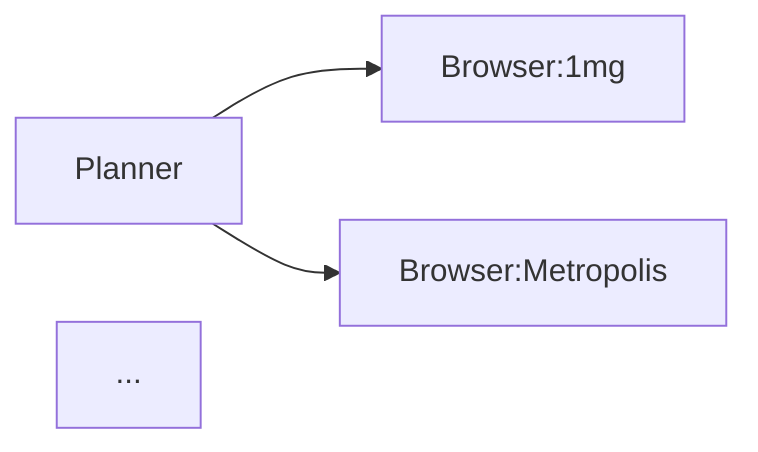

# LabLens — Implementation Handoff

> **For Claude Code.** Work through every section in order. Each section ends with a checklist.
> Do not start the next section until the current one is fully verified.
> The word "assignment" does not appear in this document intentionally — treat this as a real product build.

---

## Table of contents

1. [Product overview](#1-product-overview)
2. [Repository structure](#2-repository-structure)
3. [Environment setup](#3-environment-setup)
4. [Foundation — shared modules](#4-foundation--shared-modules)
5. [Browser cascade](#5-browser-cascade)
6. [Agent runner](#6-agent-runner)
7. [Distiller prompt](#7-distiller-prompt)
8. [NiceGUI frontend](#8-nicegui-frontend)
9. [Replay viewer](#9-replay-viewer)
10. [Requirements verification](#10-requirements-verification)
11. [GitHub deliverables](#11-github-deliverables)
12. [YouTube demo script](#12-youtube-demo-script)
13. [Appendix](#13-appendix)

---

## 1. Product overview

### 1.1 What LabLens does

LabLens accepts a plain-language query such as:

```
Compare Thyroid Profile (T3, T4, TSH) prices near Koramangala, Bangalore
```

It browses live sources, extracts prices, home collection availability, report turnaround time, and review sentiment, then returns a structured comparison table with an insight layer that reasons across sources — not just lists them.

**The core demonstration** is that static HTTP fetch + web search cannot reliably retrieve this data because prices are city-specific, JS-rendered, and hidden behind search filters and dropdowns. The four-layer browser cascade is what makes it tractable.

### 1.2 What it is not

- No booking — pure intelligence layer only
- No user accounts or stored health data
- No affiliate links, no ads
- No radiology or imaging
- India-only, Bangalore-first for the demo

### 1.3 Target sources

**Online platforms** — always queried:

| Source | URL | Expected layer |
|--------|-----|---------------|
| 1mg | labs.1mg.com | Layer 2b — JS-rendered price, city selection required |
| Netmeds | labs.netmeds.com | Layer 2b — JS-rendered, search + filter required |
| Metropolis | metropolisindia.com | Layer 1 — clean static HTML on city+test pages |
| Thyrocare | thyrocare.com | Layer 1 or 2b — package pages static, test search needs 2b |
| PharmEasy | pharmeasy.in/diagnostics | Layer 2b — dynamic, location-aware pricing |

**Nearby labs** — queried when locality is in the prompt:

| Source | Expected layer |
|--------|---------------|
| Google Maps | Blocked → fallback |
| Practo | Layer 1 or 2b |
| JustDial | Layer 1 — older site, mostly static HTML |

Top 3 nearby labs by rating within ~5 km. Google Maps is attempted first. On `gateway_blocked`, fall back to Practo, then JustDial. Blocked path must be shown in the demo — it is a valid and expected output, not a failure.

---

## 2. Repository structure

```
lablens/
├── main.py                    # NiceGUI app entry point
├── agent_runner.py            # Orchestrates cascade across all sources
├── run_trace.py               # RunTrace dataclass — save/load replay.json
├── llm_client.py              # Free provider chain (Gemini → Groq → Ollama…)
├── ui/
│   ├── query_panel.py         # Left panel: input, options, recent queries
│   ├── log_panel.py           # Centre panel: live agent log
│   ├── results_panel.py       # Right panel: Compare + Insights tabs
│   └── replay_viewer.py       # Replay Viewer tab: DAG, screenshots, cost
├── browser/                   # ← COPY UNCHANGED from base codebase
│   ├── skill.py
│   ├── driver.py
│   ├── dom.py
│   ├── highlight.py
│   └── client.py
├── flow.py                    # ← COPY UNCHANGED — orchestrator
├── skills/
│   ├── distiller_prompt.md    # NEW — lab domain distiller
│   └── agent_config.yaml      # EDIT — register browser skill + distiller
├── run_artifacts/             # Created at runtime — screenshots + replay.json
│   └── {run_id}/
│       ├── {source}/          # Per-source screenshot directories
│       │   ├── turn_01.png
│       │   └── turn_01_marked.png
│       └── replay.json
├── .env                       # API keys — never commit
├── README.md                  # See Section 11
└── ARCHITECTURE.md            # See Section 11
```

### 2.1 File modification rules

| File | Rule | Reason |
|------|------|--------|
| `flow.py` | **DO NOT TOUCH** | Core orchestrator — all new behaviour via skill catalogue |
| `browser/skill.py` | **DO NOT TOUCH** | Browser cascade implementation |
| `browser/driver.py` | **DO NOT TOUCH** | A11y driver + set-of-marks driver |
| `browser/dom.py` | **DO NOT TOUCH** | Element enumeration JS |
| `browser/highlight.py` | **DO NOT TOUCH** | Screenshot annotation with Pillow |
| `browser/client.py` | **DO NOT TOUCH** | Browser HTTP client |
| `agent_config.yaml` | **EDIT** | Add browser skill + distiller node entries |
| `llm_client.py` | **EDIT** | Apply rate limit fix from Section 4.3 |
| `distiller_prompt.md` | **CREATE** | Lab domain extraction and normalisation |
| `main.py` | **CREATE** | NiceGUI app — three-panel layout, static mount |
| `agent_runner.py` | **CREATE** | Run cascade, populate RunTrace, push log lines |
| `run_trace.py` | **CREATE** | RunTrace dataclass — serialize/deserialize |
| `ui/*.py` | **CREATE** | All four UI panel files |
| `.env` | **EDIT** | Copy from .env.example, fill in keys |

---

## 3. Environment setup

### 3.1 Python packages

```bash
pip install nicegui httpx trafilatura playwright pillow
python -m playwright install chromium
```

### 3.2 .env file

```env
# ── Required — at least GEMINI_API_KEY must be set ───────────────────────────
GEMINI_API_KEY=AIza...
GEMINI_MODEL=gemini-2.5-flash

# ── Optional fallbacks ────────────────────────────────────────────────────────
GROQ_API_KEY=gsk_...
GROQ_MODEL=openai/gpt-oss-120b

OLLAMA_MODEL=gemma4:e4b
OLLAMA_URL=http://localhost:11434

CEREBRAS_API_KEY=...
CEREBRAS_MODEL=gpt-oss-120b

NVIDIA_API_KEY=...
NVIDIA_MODEL=deepseek-ai/deepseek-v4-flash

OPEN_ROUTER_API_KEY=...
OPENROUTER_MODEL=nvidia/nemotron-3-super-120b-a12b:free

GITHUB_ACCESS_TOKEN=ghp_...
GITHUB_MODEL=openai/gpt-4.1-mini
```

**Minimum viable:** `GEMINI_API_KEY` alone covers both text (Layer 2b) and vision (Layer 3).

### 3.3 Run

```bash
cd lablens
python main.py
# Opens at http://localhost:8000
```

### 3.4 Setup checklist

- [ ] `pip install` completes without errors
- [ ] `python -m playwright install chromium` completes
- [ ] `.env` created with at least `GEMINI_API_KEY` set
- [ ] `python -c "from llm_client import LLMClient, load_env; load_env(); print(LLMClient.from_env().describe())"` prints at least one provider

---

## 4. Foundation — shared modules

### 4.1 run_trace.py

Create this file first. Every other module writes into `RunTrace`. It is the single serialisation hub — agent runner writes to it, replay viewer reads from it.

```python
# run_trace.py
from dataclasses import dataclass, field, asdict
from typing import Optional
import json, uuid, datetime


@dataclass
class TurnRecord:
    turn:          int
    elements:      int
    thinking:      str
    actions:       list[dict]
    outcomes:      list[str]
    provider:      str
    tokens_in:     int
    tokens_out:    int
    latency_ms:    int
    raw_png_path:  Optional[str] = None
    marked_path:   Optional[str] = None


@dataclass
class SourceResult:
    name:          str
    layer:         str           # "layer1" | "layer2a" | "layer2b" | "layer3" | "blocked"
    success:       bool
    blocked:       bool
    turn_log:      list[TurnRecord]
    extracted:     dict          # raw extracted data before Distiller
    tokens_in:     int
    tokens_out:    int
    elapsed_s:     float


@dataclass
class RunTrace:
    run_id:          str   = field(default_factory=lambda: uuid.uuid4().hex[:8])
    goal:            str   = ""
    locality:        str   = ""
    started:         str   = field(default_factory=lambda: datetime.datetime.now().isoformat())
    log_lines:       list[str]          = field(default_factory=list)
    sources:         list[SourceResult] = field(default_factory=list)
    cost:            list[dict]         = field(default_factory=list)
    dag_plan:        dict               = field(default_factory=dict)
    comparison_rows: list[dict]         = field(default_factory=list)
    insights:        str                = ""

    def save(self, path: str) -> None:
        with open(path, "w") as f:
            json.dump(asdict(self), f, indent=2)

    @classmethod
    def load(cls, path: str) -> "RunTrace":
        with open(path) as f:
            data = json.load(f)
        # Re-hydrate nested dataclasses
        data["sources"] = [
            SourceResult(
                **{**s, "turn_log": [TurnRecord(**t) for t in s["turn_log"]]}
            )
            for s in data["sources"]
        ]
        return cls(**data)
```

### 4.2 llm_client.py — rate limit fix

Apply two changes to the existing `llm_client.py` from the layer demo:

**Change 1 — distinguish 429 from other HTTP errors** in the `chat()` and `vision()` fallback loops:

```python
# In _OpenAICompatClient.call() and _GeminiClient.call()
# Replace generic except Exception with:
except httpx.HTTPStatusError as e:
    if e.response.status_code == 429:
        print(f"    ⚠  {provider.name}: rate limited — waiting 5s before fallback")
        await asyncio.sleep(5)
    else:
        print(f"    ⚠  {provider.name}: HTTP {e.response.status_code}")
    last_error = e
    continue
except Exception as e:
    print(f"    ⚠  {provider.name}: {type(e).__name__}: {str(e)[:100]}")
    last_error = e
    continue
```

**Change 2 — add 2s inter-turn sleep** in `layer2b_a11y.py` and `layer3_vision.py` turn loops:

```python
# At the end of each turn loop iteration, before the next turn:
await asyncio.sleep(2)  # keeps free tier RPM within limits
```

### 4.3 Foundation checklist

- [ ] `run_trace.py` created
- [ ] `RunTrace` instantiates without error: `python -c "from run_trace import RunTrace; t = RunTrace(goal='test'); print(t.run_id)"`
- [ ] `RunTrace.save()` writes valid JSON, `RunTrace.load()` round-trips cleanly
- [ ] Rate limit fix applied to `llm_client.py`
- [ ] `llm_client.py` self-test passes: `python llm_client.py` returns `{"status": "ok"}` from at least one provider

---

## 5. Browser cascade

### 5.1 Layer summary

```
URL + Goal
   │
   ├─ Precondition ──── CAPTCHA / login / geo-block detected?
   │                     YES → return gateway_blocked, stop cascade
   │
   ├─ Layer 1 ──────── httpx + trafilatura
   │   Cost: $0  Speed: ~0.2s
   │   Works: static HTML (Metropolis, JustDial, Thyrocare package pages)
   │   Fails: JS-rendered, goal requires interaction
   │
   ├─ Layer 2a ─────── Playwright + CSS selectors (no LLM)
   │   Cost: $0  Speed: ~4s
   │   Works: sites with stable known CSS classes
   │   Fails: selector timeout → escalate
   │
   ├─ Layer 2b ─────── Playwright + a11y tree + text LLM
   │   Cost: text tokens  Speed: ~5–15s
   │   Works: dynamic pages, dropdowns, filters, popovers (1mg, Netmeds)
   │   Fails: canvas-only page with no ARIA labels
   │
   └─ Layer 3 ──────── Playwright + set-of-marks screenshot + vision LLM
       Cost: image tokens (~4–8× text)  Speed: ~30s per turn
       Works: anything visible on screen
       Last resort only
```

### 5.2 Artifacts path change

The layer demo saved screenshots to `/tmp`. Change both `layer2b_a11y.py` and `layer3_vision.py` to use the stable run artifacts path:

```python
# In run_layer2b() and run_layer3() — change artifacts_dir default:
artifacts_dir = f"./run_artifacts/{run_id}/{source_name}"
```

This enables the static file mount and the screenshot thumbnail strip in the Replay Viewer.

### 5.3 agent_config.yaml additions

Add the browser skill and distiller node to the skill catalogue. The orchestrator (`flow.py`) must not be modified — these entries are how new behaviour is registered:

```yaml
skills:
  browser:
    description: >
      Fetches and interacts with web pages through a four-layer cascade:
      extract (httpx+trafilatura), deterministic (CSS selectors),
      accessibility (a11y tree + LLM), vision (set-of-marks + VLM).
      Accepts URL and goal. Returns browser output with layer used,
      actions taken, and extracted content.
    inputs: [url, goal]
    outputs: [content, layer_used, turn_log, blocked]
    prompt_file: null   # browser skill uses its own internal prompts

  distiller:
    description: >
      Receives raw extracted text from all browser sources and returns
      structured JSON: normalised comparison rows, DAG plan, recommended
      option, and markdown insights block.
    inputs: [raw_sources, goal, locality]
    outputs: [dag_plan, comparison_rows, recommended, insights]
    prompt_file: skills/distiller_prompt.md
```

### 5.4 Browser cascade checklist

- [ ] `artifacts_dir` changed to `./run_artifacts/{run_id}/{source_name}` in both layer files
- [ ] `agent_config.yaml` updated with browser skill and distiller entries
- [ ] Manual smoke test: run `layer1_extract.py` against `metropolisindia.com/parameter/bangalore/thyroid-panel-t3-t4-tsh` — confirms Layer 1 succeeds for Metropolis
- [ ] Manual smoke test: run `layer2b_a11y.py` against `labs.1mg.com` — confirms Layer 2b needed (Layer 1 fails)
- [ ] Screenshot files appear in `./run_artifacts/` after Layer 2b run

---

## 6. Agent runner

### 6.1 agent_runner.py responsibilities

`agent_runner.py` is the coordination layer between the UI and the cascade. It:

1. Accepts `goal`, `locality`, `options`, a `RunTrace` instance, and a `log_push` callback
2. Constructs target URL list from options (online platforms + nearby labs if locality given)
3. Calls the browser skill for each source sequentially (not in parallel — rate limit risk)
4. After each source: appends `SourceResult` to trace, appends `cost_entry` to trace, calls `log_push`
5. After all sources: calls Distiller, populates `trace.comparison_rows`, `trace.insights`, `trace.dag_plan`
6. Saves `replay.json` to `./run_artifacts/{run_id}/replay.json`

### 6.2 Cost entry structure

Emit this dict after each source completes and append to `trace.cost`:

```python
cost_entry = {
    "source":   source_name,      # e.g. "1mg"
    "layer":    layer_used,       # e.g. "layer2b_a11y"
    "turns":    result.turns,
    "tok_in":   result.tokens_in,
    "tok_out":  result.tokens_out,
    "blocked":  result.blocked,
    "elapsed_s": result.elapsed_s,
}
trace.cost.append(cost_entry)
```

### 6.3 Log push convention

Pass a `log_push` callable from the UI into `agent_runner`. Use this convention for line prefixes so the log panel can colour them:

```python
# Prefix convention — log panel uses these to apply colours:
# "▶ "  cyan   — node/source starting
# "✓ "  green  — success
# "✗ "  red    — failure or blocked
# "⚠ "  yellow — warning (rate limit, partial result)
# "  "  white  — detail line (turn action, element name)

log_push("▶ Browser: 1mg")
log_push("  Layer 1 → failed (JS-rendered)")
log_push("  Layer 2b → a11y tree loaded — 142 elements")
log_push("  Turn 1: type([3], 'thyroid profile')")
log_push("  Turn 2: click([8] Bangalore)")
log_push("  Turn 3: click([12] View price)")
log_push("✓ 1mg → ₹349, home ✓, 24h, T3/T4/TSH standard")
```

### 6.4 Source URL list

Build this list in `agent_runner.py` based on options:

```python
ONLINE_SOURCES = [
    {"name": "Metropolis", "url": "https://www.metropolisindia.com/parameter/{city}/{test_slug}"},
    {"name": "1mg",        "url": "https://www.1mg.com/labs/test/{test_slug}/{city}/price"},
    {"name": "Netmeds",    "url": "https://labs.netmeds.com"},
    {"name": "Thyrocare",  "url": "https://www.thyrocare.com"},
    {"name": "PharmEasy",  "url": "https://pharmeasy.in/diagnostics"},
]

NEARBY_SOURCES = [
    {"name": "Google Maps", "url": "https://maps.google.com/search/{test}+diagnostic+lab+{locality}"},
    {"name": "Practo",      "url": "https://www.practo.com/bangalore/diagnostics"},
    {"name": "JustDial",    "url": "https://www.justdial.com/Bangalore/{test}-test/nct-11188480"},
]
```

For Metropolis and 1mg, the goal prompt is sufficient for Layer 2b to navigate — the agent searches within the site rather than using a pre-constructed URL.

### 6.5 Agent runner checklist

- [ ] `agent_runner.py` created
- [ ] Sources run sequentially with `await asyncio.sleep(2)` between each
- [ ] `cost_entry` appended to trace after every source
- [ ] `SourceResult` appended to trace after every source
- [ ] `log_push` called at every meaningful step using the prefix convention
- [ ] Distiller called after all browser sources complete
- [ ] `trace.dag_plan` populated from Distiller output
- [ ] `replay.json` saved at `./run_artifacts/{run_id}/replay.json` on completion
- [ ] End-to-end test (no UI): `python agent_runner.py` runs against all sources, `replay.json` written, contents valid

---

## 7. Distiller prompt

### 7.1 File location

`skills/distiller_prompt.md`

### 7.2 Required output schema

The Distiller must return **valid JSON only** — no markdown fences, no preamble, no explanation. The orchestrator parses it directly.

```json
{
  "dag_plan": {
    "nodes": ["Planner", "Browser:1mg", "Browser:Metropolis", "Browser:Netmeds",
              "Browser:Thyrocare", "Browser:PharmEasy", "Browser:NearbyLabs",
              "Distiller", "Formatter"],
    "edges": [
      ["Planner", "Browser:1mg"],
      ["Planner", "Browser:Metropolis"],
      ["Planner", "Browser:Netmeds"],
      ["Planner", "Browser:Thyrocare"],
      ["Planner", "Browser:PharmEasy"],
      ["Planner", "Browser:NearbyLabs"],
      ["Browser:1mg", "Distiller"],
      ["Browser:Metropolis", "Distiller"],
      ["Browser:Netmeds", "Distiller"],
      ["Browser:Thyrocare", "Distiller"],
      ["Browser:PharmEasy", "Distiller"],
      ["Browser:NearbyLabs", "Distiller"],
      ["Distiller", "Formatter"]
    ]
  },
  "comparison_rows": [
    {
      "provider":        "1mg",
      "type":            "online",
      "price":           349,
      "price_note":      "",
      "home_collection": true,
      "walk_in":         false,
      "tat_hours":       24,
      "rating":          4.2,
      "review_count":    1840,
      "parameters":      ["T3", "T4", "TSH"],
      "tsh_type":        "standard",
      "backend_lab":     "Thyrocare Technologies",
      "notes":           ""
    }
  ],
  "recommended": {
    "provider": "Netmeds",
    "reason":   "Lowest price for standard TSH with home collection. Same backend lab as Thyrocare."
  },
  "insights": "## Key findings\n\n..."
}
```

### 7.3 Distiller instructions

Write the following instructions into `distiller_prompt.md`:

**Normalisation rules:**
- Map all name variants to the same test: "Thyroid Profile-1", "Thyroid Package", "T3-T4-USTSH", "Thyroid Profile Total (T3, T4 & TSH)" are all the same test
- Set `tsh_type` to `"ultrasensitive"` for Thyrocare's uTSH — this is clinically different from standard TSH, not just a naming difference. Flag it in insights.

**Insight rules:**
- Detect backend lab overlap: Netmeds and Thyrocare often use Thyrocare Technologies as the processing lab. If confirmed, note: "Booking directly on Thyrocare may be cheaper — same lab, no platform margin."
- Extract review themes from review text, not just star ratings. Surface recurring phrases: "report delayed", "wrong result", "professional staff", etc.
- Flag hidden fees: if a platform shows a base price but home collection adds a surcharge, surface the effective price.
- Recommend conservatively — weight quality signals (rating, review count, result accuracy mentions) over lowest price alone. Never recommend a provider with recent mentions of incorrect results.

**Output rules:**
- Return valid JSON only — no markdown fences, no preamble
- If a source was blocked, include it in `comparison_rows` with `"blocked": true` and `"price": null`
- `insights` field must be a markdown string (headings, bullets allowed within the string value)

### 7.4 Distiller checklist

- [ ] `skills/distiller_prompt.md` created with output schema and all instruction rules
- [ ] Test Distiller in isolation: pass mock raw_sources JSON, confirm output parses cleanly
- [ ] `dag_plan` in output contains correct nodes and edges for the sources that ran
- [ ] `tsh_type` field correctly set to `"ultrasensitive"` for Thyrocare
- [ ] `recommended` field populated with a reason string
- [ ] `insights` field is valid markdown within a JSON string (escaped newlines, no raw newlines)

---

## 8. NiceGUI frontend

### 8.1 main.py — app entry point

```python
# main.py
import asyncio
import pathlib
from nicegui import ui, app

from ui.query_panel   import QueryPanel
from ui.log_panel     import LogPanel
from ui.results_panel import ResultsPanel
from ui.replay_viewer import ReplayViewer

# Mount run_artifacts as static files — enables screenshot thumbnails
app.add_static_files("/artifacts", "./run_artifacts")

@ui.page("/")
async def index():
    ui.dark_mode()

    # Header
    with ui.row().classes("w-full items-center px-4 py-2 border-b border-gray-700 bg-gray-900"):
        ui.label("🔬 LabLens").classes("text-xl font-semibold text-blue-400")
        ui.label("Lab test price intelligence").classes("text-sm text-gray-500 ml-3")
        ui.space()
        ui.link("GitHub", "https://github.com/rraghu214/lablens").classes("text-sm text-gray-500")

    # Three-panel layout
    with ui.row().classes("w-full gap-0").style("height: calc(100vh - 48px); overflow: hidden"):
        # Left — query input (fixed width)
        with ui.column().classes("w-64 min-w-64 border-r border-gray-700 bg-gray-900 overflow-y-auto"):
            query_panel = QueryPanel()

        # Centre — live agent log (fixed width)
        with ui.column().classes("w-80 min-w-80 border-r border-gray-700 bg-gray-950"):
            log_panel = LogPanel()

        # Right — results (fills remaining space)
        with ui.column().classes("flex-1 bg-gray-900 overflow-y-auto"):
            results_panel = ResultsPanel()

    # Wire run button to agent
    query_panel.on_run(lambda goal, locality, opts: asyncio.create_task(
        run_agent(goal, locality, opts, log_panel, results_panel)
    ))

async def run_agent(goal, locality, opts, log_panel, results_panel):
    from agent_runner import AgentRunner
    from run_trace import RunTrace
    import pathlib

    trace = RunTrace(goal=goal, locality=locality)
    artifacts_root = pathlib.Path(f"./run_artifacts/{trace.run_id}")
    artifacts_root.mkdir(parents=True, exist_ok=True)

    runner = AgentRunner(
        log_push=log_panel.push,
        on_source_complete=results_panel.add_row,
        options=opts,
    )
    await runner.run(trace, artifacts_root)
    results_panel.set_insights(trace.insights)
    results_panel.set_replay(trace)

ui.run(title="LabLens", port=8000, reload=False)
```

### 8.2 ui/log_panel.py

```python
# ui/log_panel.py
from nicegui import ui

COLOUR_MAP = {
    "▶": "text-cyan-400",
    "✓": "text-green-400",
    "✗": "text-red-400",
    "⚠": "text-yellow-400",
}

class LogPanel:
    def __init__(self):
        with ui.column().classes("w-full h-full"):
            with ui.row().classes("w-full items-center px-3 py-2 border-b border-gray-700"):
                ui.label("Agent log").classes("text-xs font-mono text-gray-400 uppercase tracking-wider")
                ui.space()
                self._status = ui.badge("IDLE", color="gray").classes("text-xs")
                self._token_label = ui.label("0 tokens").classes("text-xs text-gray-500 ml-2")

            # Main log — monospace, dark, auto-scroll
            self._log = ui.log(max_lines=500).classes(
                "w-full flex-1 font-mono text-xs bg-gray-950 text-gray-300 p-2"
            ).style("height: calc(100% - 40px)")

        self._total_tokens = 0

    def push(self, line: str) -> None:
        self._log.push(line)

    def set_status(self, status: str) -> None:
        colours = {"IDLE": "gray", "RUNNING": "blue", "COMPLETE": "green", "ERROR": "red"}
        self._status.set_text(status)
        self._status.props(f'color="{colours.get(status, "gray")}"')

    def add_tokens(self, n: int) -> None:
        self._total_tokens += n
        self._token_label.set_text(f"{self._total_tokens:,} tokens")

    def clear(self) -> None:
        self._log.clear()
        self._total_tokens = 0
        self.set_status("IDLE")
        self._token_label.set_text("0 tokens")
```

> **Critical:** Never call `log_panel.push()` from a thread. Always call from the async NiceGUI event loop task. After batch push calls, add `await asyncio.sleep(0)` to yield control and allow the UI to refresh.

### 8.3 ui/query_panel.py

```python
# ui/query_panel.py
from nicegui import ui
from typing import Callable, Optional

class QueryPanel:
    def __init__(self):
        self._on_run_cb: Optional[Callable] = None
        self._recent: list[str] = []

        with ui.column().classes("w-full p-3 gap-3"):
            ui.label("What test are you looking for?").classes("text-xs text-gray-400 uppercase tracking-wider")

            self._query = ui.textarea(
                placeholder="e.g. Thyroid Profile (T3, T4, TSH) near Koramangala"
            ).classes("w-full text-sm").props("rows=3 outlined dense")

            self._locality = ui.input(
                placeholder="Locality, city"
            ).classes("w-full text-sm").props("outlined dense")
            ui.label("Near").classes("text-xs text-gray-500 -mt-2")

            ui.separator()
            ui.label("Options").classes("text-xs text-gray-400 uppercase tracking-wider")
            self._opt_online  = ui.checkbox("Online platforms",  value=True)
            self._opt_nearby  = ui.checkbox("Nearby labs",       value=True)
            self._opt_reviews = ui.checkbox("Include reviews",   value=True)
            self._opt_home    = ui.checkbox("Home collection only", value=False)

            self._run_btn = ui.button("Run search", on_click=self._handle_run).classes(
                "w-full bg-blue-600 text-white text-sm"
            )

            ui.separator()
            ui.label("Recent").classes("text-xs text-gray-400 uppercase tracking-wider")
            self._recent_container = ui.column().classes("w-full gap-1")

    def on_run(self, cb: Callable) -> None:
        self._on_run_cb = cb

    def _handle_run(self) -> None:
        goal     = self._query.value.strip()
        locality = self._locality.value.strip()
        if not goal:
            ui.notify("Please enter a test name", type="warning")
            return
        opts = {
            "online":  self._opt_online.value,
            "nearby":  self._opt_nearby.value,
            "reviews": self._opt_reviews.value,
            "home_only": self._opt_home.value,
        }
        self._add_recent(goal)
        if self._on_run_cb:
            self._on_run_cb(goal, locality, opts)

    def _add_recent(self, query: str) -> None:
        if query in self._recent:
            self._recent.remove(query)
        self._recent.insert(0, query)
        self._recent = self._recent[:5]
        self._recent_container.clear()
        with self._recent_container:
            for q in self._recent:
                ui.button(q[:40] + ("…" if len(q) > 40 else ""),
                          on_click=lambda _, qq=q: self._query.set_value(qq)
                ).classes("w-full text-left text-xs text-gray-400 bg-gray-800").props("flat dense")
```

### 8.4 ui/results_panel.py

```python
# ui/results_panel.py
from nicegui import ui
from typing import Optional

ONLINE_COLS = [
    {"name": "provider",  "label": "Provider",    "field": "provider",  "align": "left"},
    {"name": "price",     "label": "Price (₹)",   "field": "price",     "sortable": True},
    {"name": "home",      "label": "Home",        "field": "home"},
    {"name": "walk_in",   "label": "Walk-in",     "field": "walk_in"},
    {"name": "tat",       "label": "TAT",         "field": "tat",       "align": "left"},
    {"name": "rating",    "label": "Rating",      "field": "rating",    "sortable": True},
    {"name": "params",    "label": "Parameters",  "field": "params",    "align": "left"},
    {"name": "notes",     "label": "Notes",       "field": "notes",     "align": "left"},
]

class ResultsPanel:
    def __init__(self):
        with ui.column().classes("w-full h-full"):
            with ui.tabs().classes("w-full") as self._tabs:
                self._tab_compare = ui.tab("Compare")
                self._tab_insights = ui.tab("Insights")
                self._tab_replay = ui.tab("Replay")

            with ui.tab_panels(self._tabs, value=self._tab_compare).classes("w-full flex-1"):
                with ui.tab_panel(self._tab_compare):
                    self._build_compare_tab()

                with ui.tab_panel(self._tab_insights):
                    self._insight_md = ui.markdown("*Run a search to see insights.*").classes("p-4")

                with ui.tab_panel(self._tab_replay):
                    from ui.replay_viewer import ReplayViewer
                    self._replay_viewer = ReplayViewer()

    def _build_compare_tab(self):
        with ui.column().classes("w-full p-4 gap-4"):
            # Recommended card — populated by Distiller
            self._rec_card = ui.card().classes("w-full border border-blue-500 hidden")
            with self._rec_card:
                ui.label("⭐ Recommended").classes("text-xs text-blue-400 uppercase tracking-wider")
                self._rec_label = ui.markdown("")

            # Online platforms table
            ui.label("Online platforms").classes("text-sm font-medium text-gray-400")
            self._online_table = ui.table(
                columns=ONLINE_COLS, rows=[], row_key="provider"
            ).classes("w-full text-sm")

            # Nearby labs table
            ui.label("Nearby labs").classes("text-sm font-medium text-gray-400 mt-2")
            self._nearby_table = ui.table(
                columns=[
                    {"name": "provider", "label": "Name",     "field": "provider", "align": "left"},
                    {"name": "price",    "label": "Price (₹)","field": "price",    "sortable": True},
                    {"name": "home",     "label": "Home",     "field": "home"},
                    {"name": "tat",      "label": "TAT",      "field": "tat"},
                    {"name": "rating",   "label": "Rating",   "field": "rating",   "sortable": True},
                ],
                rows=[], row_key="provider"
            ).classes("w-full text-sm")

    def add_row(self, row: dict) -> None:
        """Called by agent_runner after each source completes. Row appears immediately."""
        target = self._nearby_table if row.get("type") == "nearby" else self._online_table
        target.rows.append(row)
        target.update()

    def set_insights(self, md: str) -> None:
        self._insight_md.set_content(md)
        # Populate recommended card
        # (agent_runner passes recommended separately or parse from trace)

    def set_recommended(self, provider: str, reason: str) -> None:
        self._rec_label.set_content(f"**{provider}** — {reason}")
        self._rec_card.classes(remove="hidden")

    def set_replay(self, trace) -> None:
        self._replay_viewer.load(trace)

    def clear(self) -> None:
        self._online_table.rows.clear()
        self._online_table.update()
        self._nearby_table.rows.clear()
        self._nearby_table.update()
        self._insight_md.set_content("*Run a search to see insights.*")
        self._rec_card.classes(add="hidden")
```

### 8.5 Frontend checklist

- [ ] `main.py` starts without errors: `python main.py`
- [ ] App loads at `http://localhost:8000` in dark mode
- [ ] Three panels visible side-by-side
- [ ] Query input accepts text, Run button triggers `_handle_run`
- [ ] Log panel: `log_panel.push("test line")` appears immediately in UI
- [ ] Log panel status badge changes IDLE → RUNNING → COMPLETE
- [ ] Results table: `results_panel.add_row({...})` appends row without full refresh
- [ ] Insights tab renders markdown correctly
- [ ] Recent queries list updates after each run

---

## 9. Replay viewer

### 9.1 Overview

The Replay Viewer is the fourth tab in the results panel. It provides full post-hoc transparency. It must be populatable both from a live run (`set_replay(trace)`) and from a saved `replay.json` file (Load replay button).

### 9.2 DAG rendering

Build the Mermaid source from `dag_plan` and render with `ui.mermaid()`:

```python
def _render_dag(self, dag: dict) -> None:
    if not dag:
        return
    src = "graph LR\n"
    for edge in dag.get("edges", []):
        src += f"  {edge[0]} --> {edge[1]}\n"
    ui.mermaid(src)
```

### 9.3 Screenshot thumbnail strip

```python
def _render_screenshots(self, source: SourceResult) -> None:
    screenshots = [t for t in source.turn_log if t.marked_path]
    if not screenshots:
        ui.label("No screenshots (Layer 1 or blocked)").classes("text-xs text-gray-500")
        return
    with ui.row().classes("gap-2 flex-wrap"):
        for turn in screenshots:
            url = turn.marked_path.replace("./run_artifacts", "/artifacts")
            with ui.card().tight().classes("cursor-pointer hover:ring-2 hover:ring-blue-500"):
                ui.image(url).classes("w-40 h-28 object-cover")
                ui.label(f"Turn {turn.turn} · {turn.provider}").classes("text-xs p-1 text-center text-gray-400")
                # Click to open full-size in dialog
                ui.image(url).on("click", lambda u=url: self._open_image_dialog(u))

def _open_image_dialog(self, url: str) -> None:
    with ui.dialog() as d, ui.card():
        ui.image(url).classes("max-w-4xl max-h-screen")
        ui.button("Close", on_click=d.close)
    d.open()
```

### 9.4 Cost ledger

```python
def _render_cost(self, cost: list[dict]) -> None:
    total_turns = sum(c["turns"] for c in cost)
    total_tok   = sum(c["tok_in"] + c["tok_out"] for c in cost)

    # Metric cards
    with ui.row().classes("gap-3 mb-4"):
        for label, val in [
            ("Total turns",  str(total_turns)),
            ("Total tokens", f"{total_tok:,}"),
            ("Est. cost",    "$0.00 (free tier)"),
        ]:
            with ui.card().classes("p-3 flex-1 text-center bg-gray-800"):
                ui.label(label).classes("text-xs text-gray-400")
                ui.label(val).classes("text-xl font-medium text-white")

    # Cost table
    cols = [
        {"name": "source",    "label": "Source",     "field": "source"},
        {"name": "layer",     "label": "Layer",      "field": "layer"},
        {"name": "turns",     "label": "Turns",      "field": "turns"},
        {"name": "tok_in",    "label": "Tokens in",  "field": "tok_in"},
        {"name": "tok_out",   "label": "Tokens out", "field": "tok_out"},
        {"name": "elapsed_s", "label": "Time (s)",   "field": "elapsed_s"},
    ]
    ui.table(columns=cols, rows=cost).classes("w-full text-sm")
```

### 9.5 Full replay_viewer.py structure

```python
# ui/replay_viewer.py
from nicegui import ui
from run_trace import RunTrace, SourceResult

class ReplayViewer:
    def __init__(self):
        with ui.column().classes("w-full p-4 gap-4"):
            # Save / Load controls
            with ui.row().classes("gap-2"):
                self._save_btn  = ui.button("Save replay", on_click=self._save).props("outline")
                self._load_upload = ui.upload(
                    label="Load replay.json",
                    on_upload=self._load_from_upload,
                    max_files=1,
                ).props("accept=.json flat dense")

            ui.separator()

            # DAG section
            ui.label("Planner DAG").classes("text-sm font-medium text-gray-400")
            self._dag_container = ui.column().classes("w-full")

            ui.separator()

            # Per-source sections
            ui.label("Sources").classes("text-sm font-medium text-gray-400")
            self._sources_container = ui.column().classes("w-full gap-2")

            ui.separator()

            # Cost ledger
            ui.label("Cost ledger").classes("text-sm font-medium text-gray-400")
            self._cost_container = ui.column().classes("w-full")

        self._trace: RunTrace | None = None

    def load(self, trace: RunTrace) -> None:
        self._trace = trace
        self._dag_container.clear()
        self._sources_container.clear()
        self._cost_container.clear()

        with self._dag_container:
            self._render_dag(trace.dag_plan)

        for source in trace.sources:
            with self._sources_container:
                with ui.expansion(
                    f"{source.name}  [{source.layer}]  {'✓' if source.success else '✗' if not source.blocked else '⊘'}",
                    icon="web"
                ).classes("w-full"):
                    if source.blocked:
                        ui.label("Blocked — gateway precondition fired").classes("text-red-400 text-sm")
                    else:
                        ui.label("Raw extracted data").classes("text-xs text-gray-400")
                        ui.code(str(source.extracted)[:2000]).classes("text-xs w-full")
                        ui.label("Screenshots").classes("text-xs text-gray-400 mt-2")
                        self._render_screenshots(source)

        with self._cost_container:
            if trace.cost:
                self._render_cost(trace.cost)

    def _save(self) -> None:
        if not self._trace:
            ui.notify("No trace to save", type="warning")
            return
        import pathlib
        path = f"./run_artifacts/{self._trace.run_id}/replay.json"
        pathlib.Path(path).parent.mkdir(parents=True, exist_ok=True)
        self._trace.save(path)
        ui.notify(f"Saved to {path}", type="positive")

    def _load_from_upload(self, e) -> None:
        import json
        content = e.content.read().decode()
        data = json.loads(content)
        from run_trace import RunTrace
        trace = RunTrace.load.__func__(RunTrace, data)  # or use temp file
        self.load(trace)
        ui.notify("Replay loaded", type="positive")

    # _render_dag, _render_screenshots, _render_cost, _open_image_dialog
    # as defined in Sections 9.2, 9.3, 9.4
```

### 9.6 Replay viewer checklist

- [ ] Static files mounted: `/artifacts` route serves `./run_artifacts/` correctly
- [ ] After a run: open Replay tab — DAG Mermaid diagram renders
- [ ] Per-source expansion: each source shows layer used, raw extracted data
- [ ] Screenshot thumbnails appear for Layer 2b and Layer 3 sources
- [ ] Clicking a thumbnail opens full-size annotated image in dialog
- [ ] Cost ledger shows metric cards and table with correct totals
- [ ] Save replay button writes `replay.json` to correct path
- [ ] Load replay button re-populates entire Replay tab from file without re-running agent

---

## 10. Requirements verification

All items previously marked Partial are now Covered via the implementations in Sections 4–9.

| # | Requirement | Status | Where implemented |
|---|-------------|--------|-------------------|
| 1 | 3+ visible browser actions per run | ✅ Covered | Agent log + cost table — each action logged with element name |
| 2 | No passive scraping from search snippets | ✅ Covered | Browser cascade throughout; stated in ARCHITECTURE.md |
| 3 | Orchestrator not modified | ✅ Covered | `flow.py` — DO NOT TOUCH rule in Section 2 |
| 4 | Original user goal in output | ✅ Covered | Echoed at top of Compare tab and in `replay.json` |
| 5 | Planner DAG rendered | ✅ Covered | Distiller emits `dag_plan` → `ui.mermaid()` in Replay Viewer (Section 9.2) |
| 6 | Browser path chosen shown | ✅ Covered | Agent log (live) + Replay Viewer per-source expansion |
| 7 | Browser actions taken shown | ✅ Covered | Turn-by-turn log in agent log panel and source expansion |
| 8 | Screenshots / page-state logs in UI | ✅ Covered | Static file mount + thumbnail strip in Replay Viewer (Section 9.3) |
| 9 | Extracted data shown | ✅ Covered | Raw extracted data in Replay Viewer source expansion |
| 10 | Final structured comparison table | ✅ Covered | `ui.table()` in Compare tab, rows added as sources complete |
| 11 | Turn count and cost summary in UI | ✅ Covered | Metric cards + cost table in Replay Viewer (Section 9.4) |

---

## 11. GitHub deliverables

### 11.1 README.md required sections

The README must contain all eight items below in this order:

```markdown
# LabLens

## 1. Original user goal
<!-- Paste the exact query used in the demo -->

## 2. Planner DAG


## 3. Browser path chosen
| Source | Layer | Reason |
|--------|-------|--------|
| Metropolis | Layer 1 | Static HTML — trafilatura extracted directly |
| 1mg | Layer 2b | JS-rendered — 5 turns to navigate to Bangalore price |
| Google Maps | Blocked | Anti-bot — fell back to Practo |
| ...

## 4. Browser actions taken
1mg (Layer 2b, 5 turns):
1. type([3], "thyroid profile")
2. click([8] Bangalore city selector)
3. click([12] View price button)
...

## 5. Screenshots
<!-- Embed 2–3 key annotated screenshots inline -->

## 6. Extracted data (sample)
<!-- Paste raw JSON from one source before Distiller -->

## 7. Final comparison table
| Provider | Price (₹) | Home | Walk-in | TAT | Rating | Parameters | Notes |
...

## 8. Turn count and cost summary
| Source | Layer | Turns | Tokens in | Tokens out | Time (s) |
...
Total tokens: X   Est. cost: $0.00
```

### 11.2 ARCHITECTURE.md required content

```markdown
# LabLens — Architecture

## Why a browser agent
[One paragraph on why static fetch + web search fails for lab test prices]

## Browser cascade
[Table: each source → expected layer → reason]

## What was not modified
- `flow.py` — core DAG orchestrator, unchanged
- `browser/` — full cascade implementation, unchanged

## What is new
- `agent_config.yaml` — browser skill and distiller node registered
- `distiller_prompt.md` — lab domain normalisation and insight rules
- `run_trace.py` — serialisation hub for replay
- `ui/` — NiceGUI three-panel frontend

## Provider chain
Text  : Gemini → Groq → Cerebras → NVIDIA → OpenRouter → GitHub → Ollama
Vision: Gemini → GitHub (gpt-4.1-mini) → Ollama (if vision model)

## Known limitations
- Google Maps blocks headless browsers — Practo/JustDial fallback used
- Thyrocare's uTSH is clinically different from standard TSH — Distiller flags this
- Prices are live at query time — refresh to get updated rates
```

### 11.3 GitHub checklist

- [ ] Repo created at `github.com/rraghu214/lablens` and set to public
- [ ] `README.md` contains all 8 required sections
- [ ] `ARCHITECTURE.md` written with all required sections
- [ ] `replay.json` from the demo run committed under `run_artifacts/demo/`
- [ ] `.env` is in `.gitignore` — never committed
- [ ] `run_artifacts/` has a `.gitkeep` so the directory exists but large files are gitignored

---

## 12. YouTube demo script

Target length: under 4 minutes.

| Time | Action |
|------|--------|
| 0:00 | Show the app at rest. Read the query aloud: *"Compare Thyroid Profile (T3, T4, TSH) prices near Koramangala, Bangalore"* |
| 0:15 | Type the query and locality, click Run search |
| 0:20 | Zoom into the agent log panel. Narrate: *"Watch each source — Layer 1 tries first, then escalates"* |
| 0:40 | Pause on the 1mg entry. Narrate: *"Layer 1 failed — this page is JS-rendered. Layer 2b takes over, 5 turns to navigate to the Bangalore price page"* |
| 1:00 | Pause on the Google Maps blocked entry. Narrate: *"Google Maps blocked the headless browser — cascade fell back to Practo automatically"* |
| 1:20 | Switch to Compare tab as first rows appear. Narrate: *"Table fills as each source completes — no waiting for all sources to finish"* |
| 1:45 | Switch to Insights tab. Read the uTSH warning aloud — this is the most compelling insight |
| 2:10 | Switch to Replay tab. Show the DAG Mermaid diagram |
| 2:25 | Click a screenshot thumbnail. Show the annotated set-of-marks image with numbered boxes |
| 2:40 | Show the cost ledger: total turns, total tokens, *"$0.00 — entirely free tier providers"* |
| 3:00 | Return to query panel. Change test to *"Lipid Profile"*, click Run — show it re-runs with live log |
| 3:30 | End: show GitHub repo README open with all 8 sections |

---

## 13. Appendix

### A1  Provider chain

```
Text  : Gemini → Groq → Cerebras → NVIDIA → OpenRouter → GitHub → Ollama
Vision: Gemini → GitHub (gpt-4.1-mini) → Ollama (if vision model)

Minimum viable: GEMINI_API_KEY only (covers both text and vision on free tier)
```

### A2  Expected layer per source

| Source | Expected layer | Reason |
|--------|---------------|--------|
| Metropolis | Layer 1 | Clean static HTML, city+test URL pattern |
| Thyrocare | Layer 1 or 2b | Package pages static; individual test search needs 2b |
| JustDial | Layer 1 | Older site, mostly static HTML |
| 1mg | Layer 2b | JS-rendered price, city selection required |
| Netmeds | Layer 2b | JS-rendered, search + filter required |
| PharmEasy | Layer 2b | Dynamic, location-aware pricing |
| Google Maps | Blocked → Practo | Anti-bot detection |
| Practo | Layer 1 or 2b | Relatively open |

### A3  Risk register

| Risk | Mitigation |
|------|-----------|
| 1mg JS-rendered price | Layer 1 intentionally fails — show this in demo as the key proof point |
| Google Maps blocks headless | `gateway_blocked` is a valid output — show fallback to Practo/JustDial |
| Gemini 429 rate limits | 5s delay before fallback (Section 4.2), 2s inter-turn sleep |
| NiceGUI thread safety | Never call `log.push()` from a thread — async event loop only |
| Thyrocare uTSH vs standard TSH | Distiller flags as clinical difference, not naming quirk |
| Netmeds anti-bot (Cloudflare) | `navigator.webdriver` removal + polite headers handle ~80% |

### A4  Build order summary

```
Phase 1 — Foundation
  run_trace.py + llm_client.py rate fix + .env verified

Phase 2 — Agent runner
  agent_runner.py + distiller_prompt.md
  End-to-end test without UI: replay.json written

Phase 3 — NiceGUI frontend
  main.py + log_panel.py + query_panel.py + results_panel.py
  Live log streams, table rows appear as sources complete

Phase 4 — Replay viewer
  replay_viewer.py + static file mount
  DAG renders, screenshots show, cost table populated

Phase 5 — Submission
  Full demo run → YouTube → README → ARCHITECTURE → GitHub → LinkedIn
```
