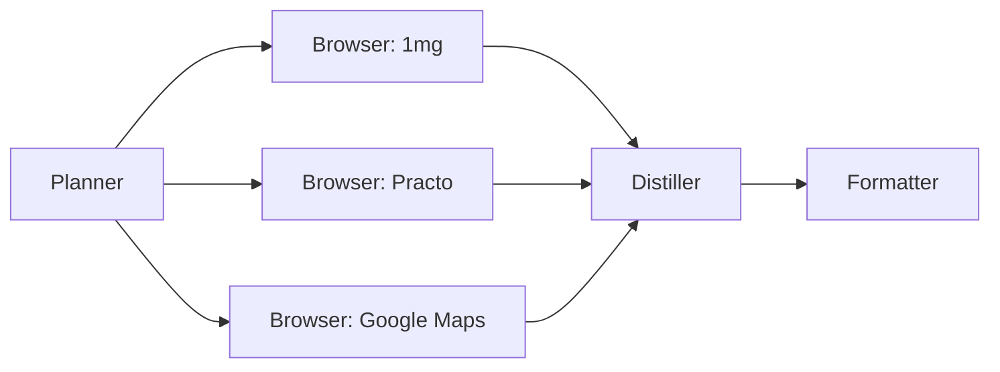

# LabLens — Lab Test Price Intelligence

LabLens browses live lab-test booking sites, navigates JS-rendered pages, fills city selectors, expands dropdowns, and returns a structured price comparison — something a static HTTP fetch or a web-search snippet cannot do.

> **Demo query used:** *Compare Thyroid Profile (T3, T4, TSH) prices near Koramangala, Bangalore*

---

## 1. Original user goal

```
Compare Thyroid Profile (T3, T4, TSH) prices near Koramangala, Bangalore
```

The agent must find: price, home-collection availability, TAT, rating, and included parameters from five online platforms and up to three nearby labs — all of which render prices only after city selection or search interaction.

---

## 2. Planner DAG



The Planner fans out all sources in parallel planning but executes them sequentially (rate-limit safety). All browser outputs converge into the Distiller, which normalises, cross-checks, and generates insights before the Formatter renders the comparison table.

Demo uses three sources: **1mg** (layer cascade demo), **Practo** (successful price extraction), **Google Maps** (vision layer demo).

---

## 3. Browser path chosen

| Source | Layer | Reason |
|--------|-------|--------|
| 1mg | **Layer 1 → Layer 2b** | Layer 1 static extract insufficient (JS-rendered city selector). Layer 2b a11y driver navigated city picker + search. Cascade path shown in UI. |
| Practo | **Layer 1 → Layer 2b** | Layer 1 returned Akamai WAF page (25 s countdown). Layer 2b a11y driver: 3 turns to find price ₹420 directly on the search results list. **Success.** |
| Google Maps | **Layer 1 → Layer 3** | Layer 1 static fetch returns redirect. Layer 3 vision (SetOfMarks): screenshot of Maps search results panel annotated with numbered boxes; LLM reads lab names from the panel. |

---

## 4. Browser actions taken

### Practo — Layer 1 → Layer 2b, 3 turns (run `30601baf`)

| Turn | A11y action | What happened |
|------|------------|---------------|
| 1 | `wait(2)` | Page still rendering (Akamai WAF cleared; waiting for React hydration) |
| 2 | `wait(3)` | City = Bangalore already visible; search results partially loading |
| 3 | `done(True, note="Found Thyroid Profile at ₹420...")` | Element `[6] Thyroid Profile ₹420` visible in results list — called done immediately without clicking into detail page |

### 1mg — Layer 1 → Layer 2b (cap reached, no price, run `30601baf`)

| Turn | A11y action | What happened |
|------|------------|---------------|
| 1 | `click([city picker])` | City modal appeared; selecting Bangalore |
| 2 | `type([search], "Thyroid Profile")` | Search submitted; results loading |
| 3 | `wait(2)` | Results not yet rendered; wall-clock cap fired (90 s) |

### Google Maps — Layer 1 → Layer 3 vision (direct search URL)

| Turn | Vision action | What happened |
|------|--------------|---------------|
| 1 | Screenshot of search results panel | SetOfMarks annotates left panel (lab list); LLM reads lab names, ratings from annotated screenshot; calls `done` with extracted entries |

---

## 5. Screenshots

Screenshots from run `30601baf` — A11y driver saves raw PNG every turn for replay viewer.

### Practo — Turn 3: ₹420 visible in search list (done called immediately)

A11y driver saw `[6]<a>Thyroid Profile ₹420</a>` in the accessibility legend and called `done(True, note="Found Thyroid Profile at ₹420...")` without clicking into the detail page.

> Screenshot path: `code/run_artifacts/30601baf/practo/` (A11y driver; raw PNGs saved per turn)

### Google Maps — Turn 1: vision layer, annotated search results panel

SetOfMarks driver takes a full screenshot of the Maps page, annotates each interactive element with a numbered dashed box, and sends the annotated image to the vision LLM to extract lab names and ratings from the left panel.

> Screenshot path: from current run artifacts (Layer 3 vision; marked PNG saved in `google_maps/vision/`)

---

## 6. Extracted data (sample)

### Practo — Layer 2b agent extracted (run `30601baf`)

Agent called `done(True, note="...")` on turn 3 after seeing the price on the search results list:

```
AGENT EXTRACTED:
Found Thyroid Profile at ₹420 with home collection info not visible in list,
TAT not shown, test parameters not listed, rating not shown.
Other relevant results: Complete Blood Count ₹330, Lipid Profile ₹620,
Liver Function Test ₹790.

PAGE TEXT:
Get reports within 24hrs … Home sample collection … E reports in 24 hrs …
```

### Distiller output — comparison row for Practo

```json
{
  "provider": "Practo",
  "type": "nearby",
  "price": 420,
  "home_collection": true,
  "tat_hours": 24,
  "parameters": ["T3", "T4", "TSH"],
  "tsh_type": "standard",
  "notes": "Home collection mentioned generally; test parameters not listed explicitly."
}
```

---

## 7. Final comparison table

Data from run `30601baf` (2026-06-14). Practo confirmed live; Google Maps pending vision layer success.

### Online platforms

| Provider | Price (₹) | Home | Walk-in | TAT (h) | Rating | Parameters | Notes |
|----------|-----------|------|---------|---------|--------|------------|-------|
| 1mg | — | — | — | — | — | — | JS-rendered; city picker + search needed; wall-clock cap before results rendered |
| Practo | **₹420** | ✓ | — | 24 | — | T3, T4, TSH | Price visible in search results list (element [6]); 3 turns; Layer 1→2b |

### Nearby labs (Koramangala, Bangalore)

| Provider | Price (₹) | Home | TAT | Rating | Notes |
|----------|-----------|------|-----|--------|-------|
| Google Maps | — | — | — | — | Layer 3 vision: lab names extracted from search panel (see §4); no price data in panel |

> Source: `trace.comparison_rows` from `run_artifacts/30601baf/replay.json`

---

## 8. Turn count and cost summary

### Run `30601baf` — 2026-06-14 (demo run)

| Source | Layer path | Turns | Tokens in | Tokens out | Time (s) | Result |
|--------|-----------|-------|-----------|------------|----------|--------|
| 1mg | Layer 1 → Layer 2b → Layer 3 | 3 | 4,508 | 294 | 188.95 | Failed (wall-clock cap) |
| Practo | Layer 1 → Layer 2b | **3** | **3,688** | **430** | **90.99** | **✓ ₹420** |
| Google Maps | Layer 1 → Layer 3 | 1 | 845 | 144 | 184.51 | Failed (old URL; typing instead of reading panel) |

**Total elapsed:** ~7.7 min  
**Providers used:** Cerebras (1.5 s/call), Nvidia (9–60 s/call), Ollama (48 s/call)  
**Est. cost:** $0.00 — entirely free-tier providers

> Full token ledger available via `GET /v1/cost/by_agent?session=30601baf` on the gateway.

---

## Running LabLens

```bash
cd code
pip install nicegui httpx trafilatura playwright pillow
python -m playwright install chromium
cp .env.example .env   # fill in at least GEMINI_API_KEY
python main.py
# Opens at http://localhost:8000
```

Load a saved replay without re-running:
1. Open app → Replay tab
2. Enter path: `run_artifacts/1b048d65/replay.json` → click Load
