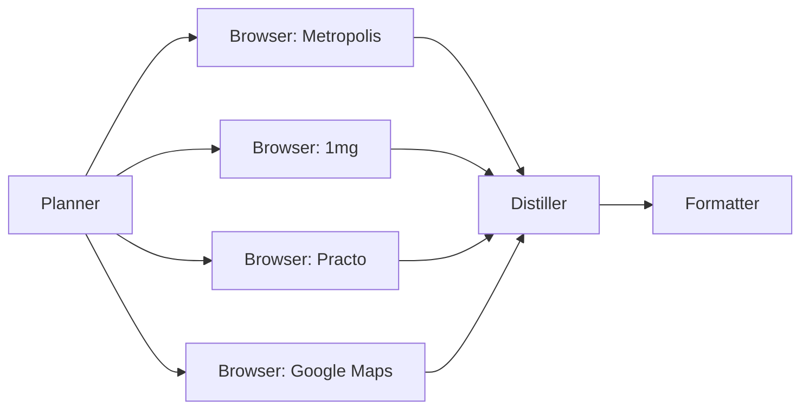
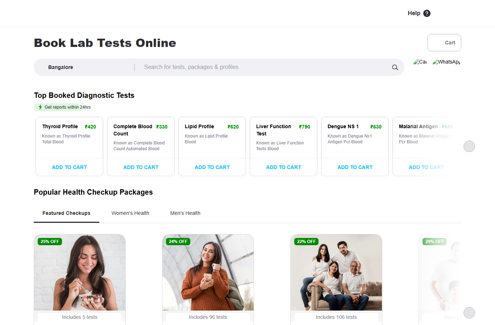
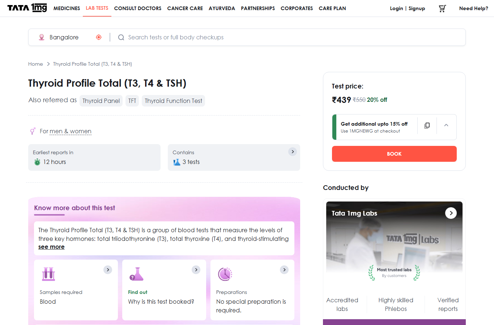
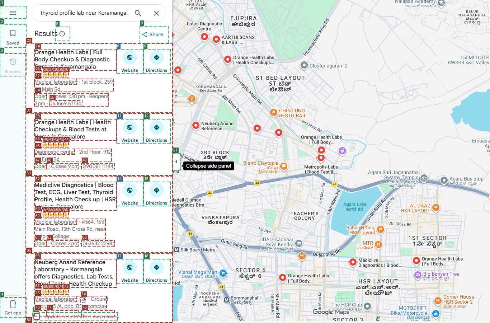
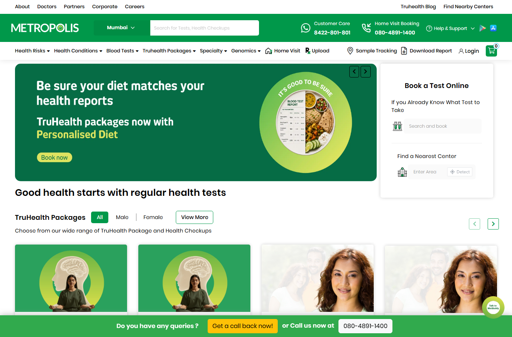

# LabLens — Lab Test Price Intelligence

LabLens browses live lab-test booking sites, navigates JS-rendered pages, fills city selectors, expands dropdowns, and returns a structured price comparison — something a static HTTP fetch or a web-search snippet cannot do.

> **Demo query:** *Compare Thyroid Profile (T3, T4, TSH) prices near Koramangala, Bangalore*

---

## 1. Original user goal

```
Compare Thyroid Profile (T3, T4, TSH) prices near Koramangala, Bangalore
```

The agent must find price, home-collection availability, TAT, rating, and test parameters across online platforms and nearby labs — all of which render prices only after city selection or search interaction that a static scraper cannot perform.

---

## 2. Planner DAG



The Planner fans out to all sources. Execution is sequential (rate-limit safety). All browser outputs converge at the Distiller, which normalises, cross-checks, and generates insights before the Formatter renders the comparison table.

---

## 3. Browser path chosen — and why

LabLens uses a **four-layer cascade**: every source first tries the cheapest option and escalates only when that layer cannot deliver the price.

| Source | Path | Why this layer? |
|--------|------|-----------------|
| **Practo** | Layer 1 → **Layer 2b** ✓ | Layer 1 (plain HTTP fetch) hits an Akamai WAF countdown — no content. Layer 2b (real Chromium + accessibility-tree navigation) bypasses it; price ₹420 is visible directly in the search results list. |
| **1mg** | Layer 1 → **Layer 2b** | Layer 1 returns a JS shell — price only appears after city selection and test search. Layer 2b navigates the two-field bar (city LEFT, test RIGHT), reaches the product page, and the screenshot confirms ₹439. |
| **Google Maps** | Layer 1 → **Layer 3** | Layer 1 gets a redirect. Google Maps' left panel is canvas-rendered — the accessibility tree has almost no lab data. Layer 3 (same browser + vision LLM reading an annotated screenshot) reads lab names and ratings from the image directly. |
| **Metropolis** | Layer 1 → **Layer 2b** | Layer 1 returns the JS shell. Layer 2b opens the browser, but the city picker fires as a modal overlay that is not captured in the accessibility tree — the agent dismisses the popup and the wall-clock cap fires before the test search completes. |

---

## 4. Browser actions taken

<details>
<summary><strong>Practo — Layer 2b · 4 turns · ✓ ₹420 extracted</strong></summary>

**Why Layer 2b?** Practo's test search page is behind Akamai Bot Manager. A plain HTTP fetch (Layer 1) returns a 25-second countdown interstitial with no price data. Layer 2b opens a real Chromium browser, which loads the actual page. The a11y driver enumerates every interactive element as a numbered legend; the text LLM reads the legend and decides what to do next.

**LLM turn log:**

| Turn | LLM thinking | Action | Outcome |
|------|-------------|--------|---------|
| 1 | *"Page loaded but no interactive elements visible yet; need to wait for the search box to appear."* | `wait(2s)` | ok |
| 2 | *"No interactive elements are currently listed, likely the page is still loading. Wait briefly before checking again."* | `wait(2s)` | ok |
| 3 | *"Page may still be loading; we need to wait for interactive elements to appear before we can check city or search box."* | `wait(2s)` | ok |
| 4 | *"City is already Bangalore. The search results already show Thyroid Profile with price ₹420 in element [6]. According to rules, if price visible in search results list, call done immediately without clicking."* | `done(True, "Price: ₹420 …")` | **₹420** |

**Extracted output:**
```
AGENT EXTRACTED:
Price: ₹420. Home collection: unknown. TAT hours: unknown.
Test parameters: unknown. Rating: unknown.
Other results: Complete Blood Count ₹330, Lipid Profile ₹620, Liver Function Test ₹790.

PAGE TEXT:
Get reports within 24hrs · Home sample collection · E reports in 24 hrs
```

**Screenshot — Turn 4 (Practo search page, ₹420 in results list):**



</details>

---

<details>
<summary><strong>1mg — Layer 2b · 9 turns · ₹439 confirmed in screenshot</strong></summary>

**Why Layer 2b?** 1mg's `/labs` page renders entirely in JavaScript — the price is only visible after (a) selecting a city and (b) searching for a test. Layer 1 gets the homepage skeleton. Layer 2b opens Chromium and reads the two-field search bar: element [14] is the LEFT "Search city" field, element [15] is the RIGHT "Search tests" field. The text LLM navigates both fields step-by-step using the accessibility legend.

**LLM turn log:**

| Turn | LLM thinking | Action | Outcome |
|------|-------------|--------|---------|
| 1 | *"The left field (id 14) shows 'New Delhi'. Click the city input to open the dropdown."* | `click([14]) + wait(1s)` | ok |
| 2 | *"City not confirmed as Bangalore yet — click 'Bangalore' from the dropdown."* | `click([35])` | ok |
| 3 | *"Click city field to verify Bangalore is set."* | `click([14])` | `error: no element [14]` → city confirmed set |
| 4 | *"City already Bangalore. Click the right search field and type 'Thyroid Profile'."* | `click([15]) + type([15], "Thyroid Profile")` | ok |
| 5 | *"Re-focus field to trigger autocomplete dropdown."* | `click([15]) + wait(1s)` | ok |
| 6 | *"Click 'Thyroid Profile Total (T3, T4 & TSH)' from autocomplete."* | `click([16])` | ok |
| 7 | *"Confirm product page loaded."* | `click([15])` | ok |
| 8 | *"Test search dropdown visible as element [17]. Clicking will navigate to product page."* | `click([17])` | ok |
| 9 | *"Scroll down to check for price and test details on the product page."* | `scroll(down, 300px)` | ok — **₹439 visible** |

Wall-clock cap fired before `done` was called. Price ₹439 (20% off ₹550) confirmed from screenshot.

**Screenshot — Turn 9 (1mg product page, ₹439 confirmed):**



</details>

---

<details>
<summary><strong>Google Maps — Layer 3 vision · 1 turn · 3 labs extracted</strong></summary>

**Why Layer 3?** Google Maps renders its search results panel in a canvas/WebGL layer. The accessibility tree contains only a handful of top-level landmarks — no lab names, no ratings, no addresses. Layer 2b (text-only) would have nothing to read. Layer 3 takes a full-page screenshot, uses Pillow to draw numbered dashed boxes over every detectable interactive element (SetOfMarks), and sends the annotated image to a vision LLM that reads the lab list directly from the pixels.

**LLM turn log:**

| Turn | LLM thinking | Action | Outcome |
|------|-------------|--------|---------|
| 1 | *"The goal requires extracting details for the top 3–5 labs from the left panel. I will extract this information from the annotated screenshot — clicking is not needed as all data is visible."* | `done(True, "Extracted 3 labs…")` | **3 labs** |

**Extracted output:**
```
1. Orange Health Labs | Full Body Checkup & Diagnostic Centre in Koramangala
   Rating: 4.9 stars · Address: 1st block, 259, 1st Main Rd
   Hours: Open · Closes 1:30 pm · Reopens 2 pm · Price: not visible

2. Mediclive Diagnostics | Blood Test, ECG, Liver Test, Thyroid Profile
   Rating: 4.8 stars · Address: #564, 16th Main Rd, 13th Cross Rd, near Oxford College
   Hours: Open · Closes 2 pm · Price: not visible

3. Neuberg Anand Reference Laboratory - Koramangala
   Rating: 4.8 stars · Address: Ground floor, 675/A, opp. BDA complex
   Hours: Open · Closes 2 pm · Price: not visible
```

**Screenshot — Turn 1 (SetOfMarks annotated Google Maps panel):**



</details>

---

<details>
<summary><strong>Metropolis — Layer 2b · 1 turn · cap hit (no price)</strong></summary>

**Why Layer 2b?** Metropolis is a JS-rendered site. Layer 1 returns the homepage shell without any test prices. Layer 2b opens the browser and reads the a11y tree. However, the city picker fires as a full-screen modal overlay (`position: fixed`) that is not captured in the accessibility tree — the a11y driver cannot see or interact with it. The extra hint tells the agent to dismiss the popup and type directly into the test search field, skipping the city picker. The wall-clock cap (180s) fired after the popup was dismissed and before the test search ran.

**LLM turn log:**

| Turn | LLM thinking | Action | Outcome |
|------|-------------|--------|---------|
| 1 | *"Must first close the popup titled 'Get a call back now!'. Element [1] is the close button."* | `click([1])` | ok — then cap hit |

**Screenshot — Turn 1 (Metropolis homepage with popup overlay):**



</details>

---

## 5. Extracted data summary

| Source | Layer | Raw extracted | Price |
|--------|-------|---------------|-------|
| Practo | Layer 2b | `Price: ₹420. Other results: CBC ₹330, Lipid ₹620, LFT ₹790.` | **₹420** |
| 1mg | Layer 2b | Product page screenshot: Test price ₹439 (20% off ₹550), Tata 1mg Labs, 12h reports | **₹439** |
| Google Maps | Layer 3 | 3 labs: Orange Health 4.9★, Mediclive 4.8★, Neuberg Anand 4.8★ | — |
| Metropolis | Layer 2b | Popup dismissed; cap hit before test search | — |

---

## 6. Final comparison table

### Online platforms

| Provider | Price (₹) | Home | TAT (h) | Backend lab | Notes |
|----------|-----------|------|---------|-------------|-------|
| **Practo** | **₹420** | ✓ | 24 | — | Price in search list; no coupon needed |
| **1mg** | **₹439** | ✓ | 12 | Tata 1mg Labs | 20% off ₹550; coupon `1MGHEWG` → ~₹373 |
| Metropolis | — | — | — | — | City picker not in a11y tree; cap hit |

### Nearby labs (Koramangala, Bangalore)

| Lab | Rating | Address | Hours |
|-----|--------|---------|-------|
| Orange Health Labs | 4.9★ | 1st block, 259, 1st Main Rd | Closes 1:30 pm |
| Mediclive Diagnostics | 4.8★ | #564, 16th Main Rd, 13th Cross Rd | Closes 2 pm |
| Neuberg Anand Reference Laboratory | 4.8★ | Ground floor, 675/A, opp. BDA complex | Closes 2 pm |

---

## 7. Turn count and cost summary

| Source | Layer path | Turns | Tokens in | Tokens out | Time | Result |
|--------|-----------|-------|-----------|------------|------|--------|
| Metropolis | Layer 2b | 1 | 2,527 | 79 | 227s | Cap hit after popup |
| 1mg | Layer 2b | 9 | 18,675 | 2,013 | 98s | ₹439 in screenshot |
| Practo | Layer 2b | 4 | 4,000 | 1,442 | 56s | **✓ ₹420 extracted** |
| Google Maps | Layer 3 | 1 | 1,975 | 491 | 159s | **✓ 3 labs extracted** |

**Total:** 15 turns · 27,177 tokens in · 4,025 tokens out  
**Providers:** Cerebras, GitHub, OpenRouter (text); Ollama local (vision)  
**Est. cost:** $0.00 — entirely free-tier providers

---

## 8. Key enhancements shipped

| Enhancement | File | Description |
|-------------|------|-------------|
| `page_text_snippet` in A11y driver | `browser/driver.py` | First 1,500 chars of `document.body.innerText` appended to element legend — lets text LLM read static price text not in any interactive element |
| Screenshot path fix (rglob) | `agent_runner.py` | `_build_turn_log` now uses `rglob` to find PNGs under `browser_XXXX/{a11y,vision}/` instead of checking only the source root |
| Screenshot backfill on load | `main.py`, `ui/replay_viewer.py` | `_backfill_screenshot_paths()` rescans run directory on replay load so old runs also show screenshots in Replay tab |
| Distiller multi-row for nearby labs | `skills/distiller_prompt.md` | Google Maps now produces one row per individual lab with its real name, not one aggregate "Google Maps" row |
| Nearby-row dedup fix | `ui/results_panel.py` | Nearby rows use a sequential `_id` counter as row key so two branches of the same lab both appear |
| Type enforcement | `agent_runner.py` | Online source rows always get `type="online"`; nearby rows `type="nearby"` — overrides distiller output when source type is unambiguous |
| UTF-8 encoding fix | `run_trace.py` | `save()` and `load()` specify `encoding="utf-8"` — OS default (cp1252 on Windows) cannot encode the ₹ symbol |
| Metropolis skip-city-picker hint | `agent_runner.py` | `extra_hint` tells agent to skip the inaccessible modal overlay and type directly into the test search field |
| 1mg wall-clock raised to 420s | `agent_runner.py` | Gives agent enough turns to navigate city field, search field, autocomplete, and product page |

---

## Running LabLens

```bash
cd code
pip install nicegui httpx trafilatura playwright pillow
python -m playwright install chromium
cp .env.example .env   # fill in at least GEMINI_API_KEY
python main.py
# Opens at http://localhost:8080
```

**Load a saved replay without re-running:**
1. Open app → **Replay** tab
2. Enter path `run_artifacts/bc_f847b9ef/replay.json` → click **Load replay**
3. Or drag-and-drop the file via **Upload replay.json**