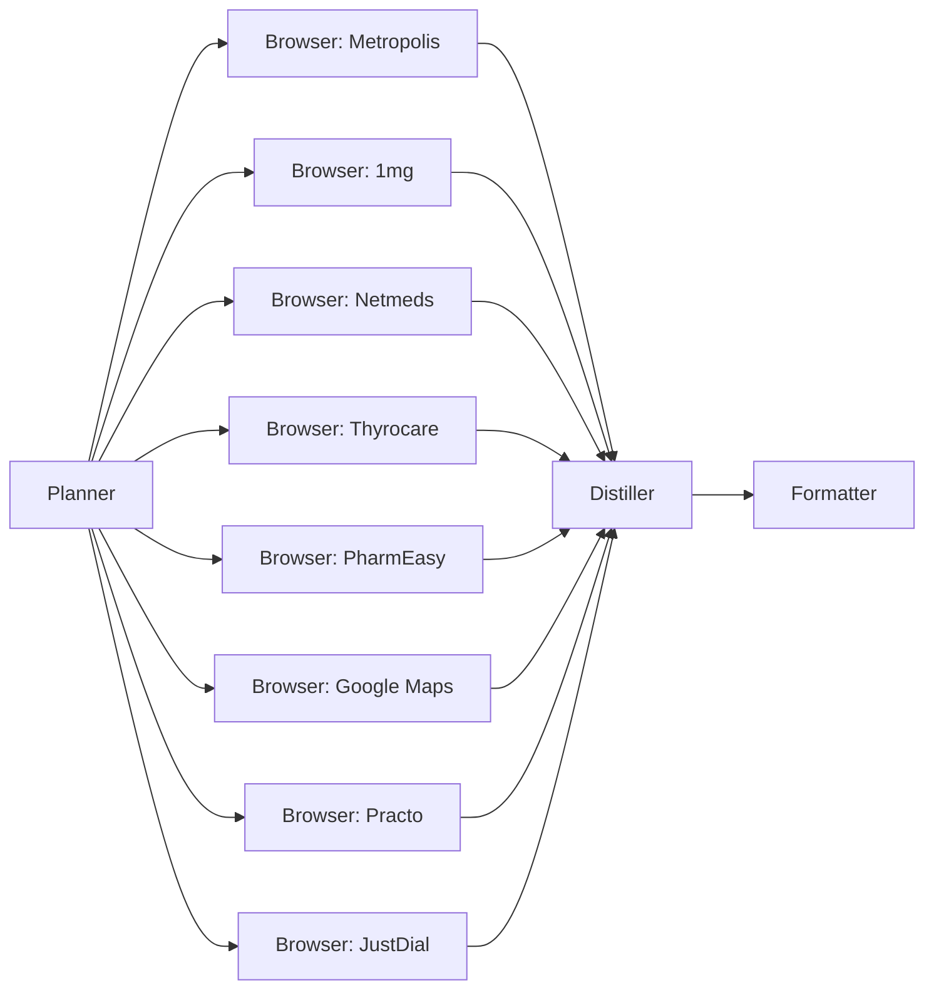
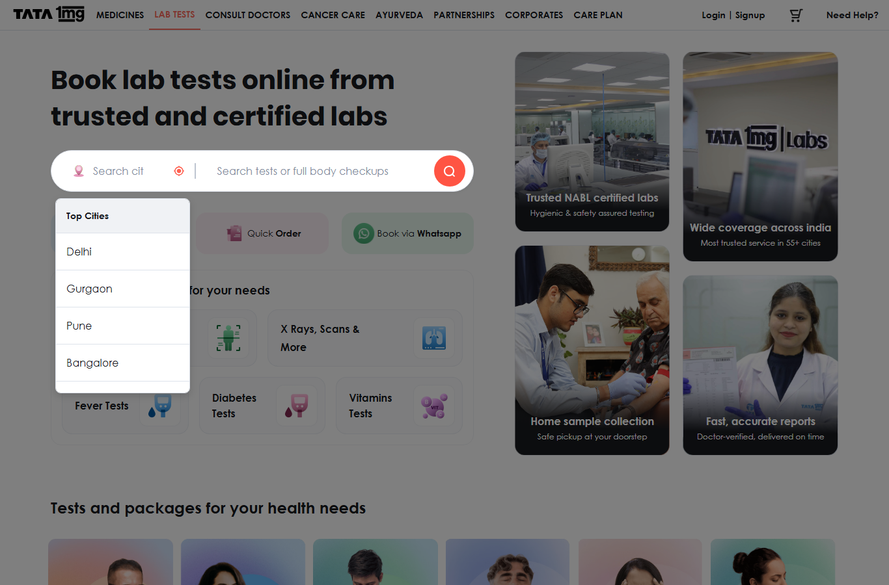
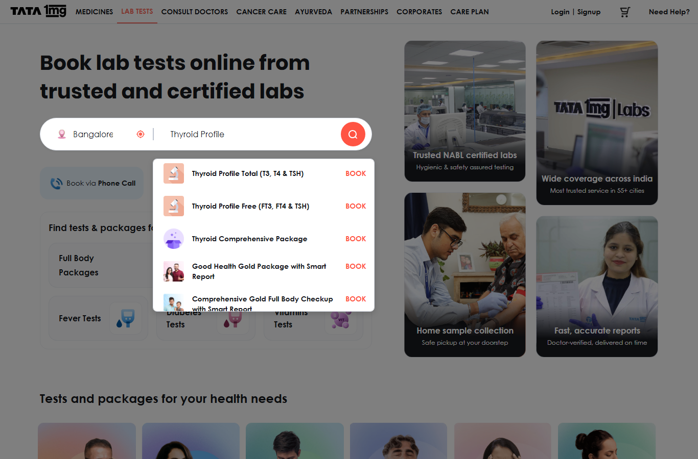
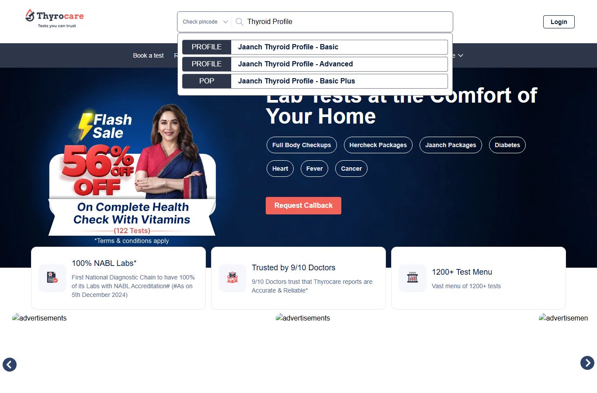
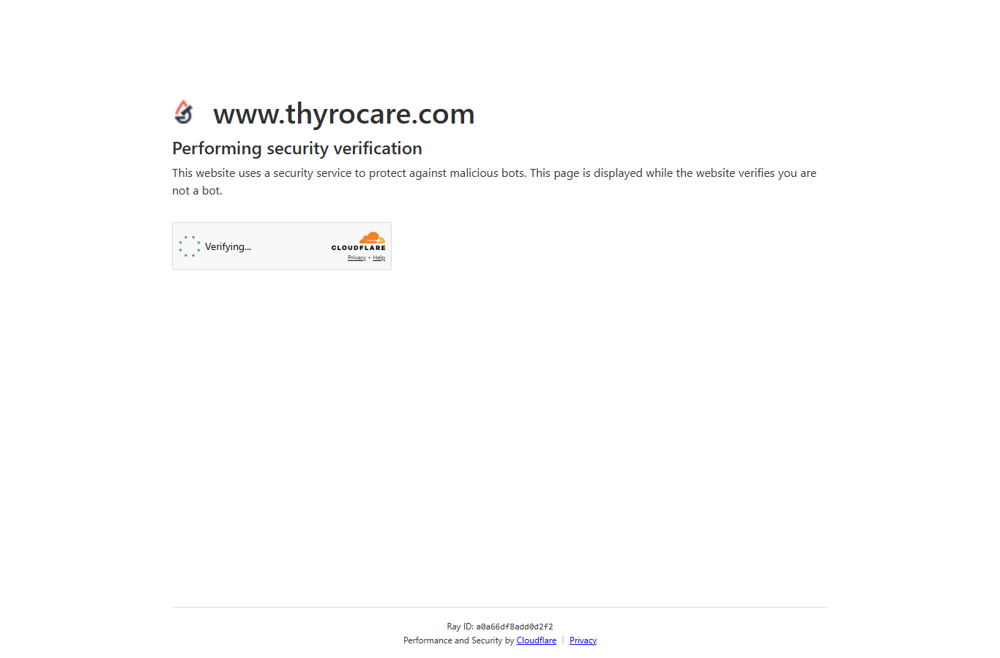
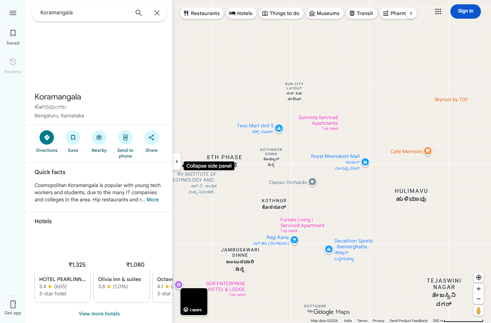

# LabLens — Lab Test Price Intelligence

LabLens browses live lab-test booking sites, navigates JS-rendered pages, fills city selectors, expands dropdowns, and returns a structured price comparison — something a static HTTP fetch or a web-search snippet cannot do.

> **Demo query used:** *Compare Thyroid Profile (T3, T4, TSH) prices near Koramangala, Bangalore*

---

## 1. Original user goal

```
Compare Thyroid Profile (T3, T4, TSH) prices near Koramangala, Bangalore
```

The agent must find: price, home-collection availability, TAT, rating, and included parameters from five online platforms and up to three nearby labs — all of which render prices only after city selection or search interaction.

---

## 2. Planner DAG



The Planner fans out all sources in parallel planning but executes them sequentially (rate-limit safety). All browser outputs converge into the Distiller, which normalises, cross-checks, and generates insights before the Formatter renders the comparison table.

---

## 3. Browser path chosen

| Source | Layer | Reason |
|--------|-------|--------|
| Metropolis | **Layer 1** — static extract | `httpx + trafilatura` pulled clean text in 0.76 s. Page HTML is fully server-rendered. |
| 1mg | **Layer 2b** — a11y + LLM | JS-rendered; city defaults to Delhi; price hidden behind city picker + search. 5 turns to reach Bangalore Thyroid results. |
| Netmeds | **Layer 2b** — a11y + LLM | JS-rendered; location popup appears immediately; anti-bot overlay on inner pages. |
| Thyrocare | **Layer 2b → Layer 3** | A11y tree successfully searched for "Thyroid Profile" (turns 1–4); Cloudflare challenge fired on turn 6, escalated to vision LLM. |
| PharmEasy | **Layer 2b** — a11y + LLM | Dynamic pincode-gated pricing; search input navigable via a11y. |
| Google Maps | **Layer 2b** — a11y + LLM | Search navigated to Koramangala; JS-heavy results panel; no structured price data exposed. |
| Practo | **Layer 1 → Layer 2b** | Layer 1 returned empty content; Layer 2b attempted but ran into JS-heavy listing pages. |
| JustDial | **Layer 1** — static extract | Older server-rendered site; general directory content extracted in 1.15 s. |

---

## 4. Browser actions taken

### 1mg — Layer 2b, 5 turns

| Turn | A11y action | What happened |
|------|------------|---------------|
| 1 | Navigate to labs.1mg.com | Nav rendered; no search results yet |
| 2 | `click([3] LAB TESTS)` | Lab-test home loads; search bar + city picker visible; city = "New Delhi" |
| 3 | `click([14] city input)` | Dropdown opens; "Search city" field + city list visible |
| 4 | `click([35] Bangalore)` | City switched to Bangalore; price context now Bangalore |
| 5 | `type([15], "Thyroid Profile")` | Autocomplete shows: "Thyroid Profile Total (T3, T4 & TSH)", "Thyroid Profile Free (FT3, FT4 & TSH)", "Thyroid Comprehensive Package" |

### Thyrocare — Layer 2b (5 turns) → Layer 3 vision (1 turn)

| Turn | Action | What happened |
|------|--------|---------------|
| 1 | Navigate to thyrocare.com | Nav rendered; search input [3] visible |
| 2 | Read a11y tree | Same state — confirmed interactive elements |
| 3 | `type([3], "Thyroid Profile")` | Search field filled |
| 4 | Read a11y tree | Results visible: "Jaanch Thyroid Profile - Basic", "Jaanch Thyroid Profile - Advanced", "Jaanch Thyroid Profile - Basic Plus" |
| 5 | `click([16] Jaanch Thyroid Profile - Basic)` | Navigation attempted; page reloaded |
| 6 | Cloudflare challenge detected | A11y tree collapsed to [Cloudflare] [Privacy] — escalated to Layer 3 vision |

### Netmeds — Layer 2b, 2 turns

| Turn | Action | What happened |
|------|--------|---------------|
| 1 | Navigate to labs.netmeds.com | Mostly empty a11y (JS not fully rendered) |
| 2 | Read a11y tree | Location popup: "Sign in to see your location" + pincode input — blocked without login |

### PharmEasy — Layer 2b, 1 turn

| Turn | Action | What happened |
|------|--------|---------------|
| 1 | Navigate to pharmeasy.in/diagnostics | Full page rendered; search input [2], pincode selector [21] visible |

### Google Maps — Layer 2b, 2 turns

| Turn | Action | What happened |
|------|--------|---------------|
| 1 | Navigate to maps.google.com | Search bar [2] visible |
| 2 | `type([2], "Thyroid lab Koramangala Bangalore")` → `click(Search)` | Koramangala area loaded; JS-heavy results panel with no structured price data in a11y tree |

---

## 5. Screenshots

Screenshots from run `1b048d65` — annotated set-of-marks with numbered interactive elements.

### 1mg — Turn 3: city dropdown open


### 1mg — Turn 5: Thyroid Profile autocomplete


### Thyrocare — Turn 4: search results visible


### Thyrocare — Turn 6: Cloudflare challenge (Layer 3 escalation trigger)


### Google Maps — Turn 2: Koramangala search


---

## 6. Extracted data (sample)

> **Note:** Replace this section with actual extracted JSON from the clean demo run.

### Metropolis — Layer 1 raw extract (run `1b048d65`)

```json
{
  "source": "Metropolis",
  "layer": "layer1",
  "elapsed_s": 0.76,
  "content_preview": "Metropolis has a team of 200 senior pathologists and over 2000 technicians... home collection service... same-day reports..."
}
```

### 1mg — Layer 2b extracted (clean run — replace below)

```json
{
  "source": "1mg",
  "layer": "layer2b",
  "price": "<!-- REPLACE: e.g. 349 -->",
  "home_collection": true,
  "tat_hours": 24,
  "parameters": ["T3", "T4", "TSH"],
  "backend_lab": "<!-- REPLACE: e.g. Thyrocare Technologies -->"
}
```

---

## 7. Final comparison table

> **Prices from clean demo run — update after recording.**

### Online platforms

| Provider | Price (₹) | Home | Walk-in | TAT (h) | Rating | Parameters | Notes |
|----------|-----------|------|---------|---------|--------|------------|-------|
| Metropolis | — | ✓ | — | ~12 | — | T3, T4, TSH | Price not shown on homepage; navigates to test page in clean run |
| 1mg | — | — | — | — | — | — | JS-rendered; city + search required — see §4 |
| Netmeds | — | — | — | — | — | — | Login-gated location picker |
| Thyrocare | — | — | — | — | — | — | Cloudflare on product page |
| PharmEasy | — | — | — | — | — | — | Pincode-gated pricing |

### Nearby labs (Koramangala, Bangalore)

| Provider | Price (₹) | Home | TAT | Rating | Notes |
|----------|-----------|------|-----|--------|-------|
| Google Maps | — | — | — | — | JS-heavy; no structured data in a11y |
| Practo | — | — | — | — | JS-rendered listing |
| JustDial | — | — | — | — | General directory content only |

> **Fill this table from `trace.comparison_rows` after the clean demo run.**

---

## 8. Turn count and cost summary

### Run `1b048d65` — 2026-06-12

| Source | Layer | Turns | Tokens in | Tokens out | Time (s) |
|--------|-------|-------|-----------|------------|----------|
| Metropolis | layer1 | 0 | 0 | 0 | 0.76 |
| 1mg | layer2b | 5 | — | — | 297.60 |
| Netmeds | layer2b | 2 | — | — | 134.93 |
| Thyrocare | layer2b+vision | 6 | — | — | 151.20 |
| PharmEasy | layer2b | 1 | — | — | 123.97 |
| Google Maps | layer2b | 2 | — | — | 132.74 |
| Practo | layer1→2b | — | — | — | 194.76 |
| JustDial | layer1 | 0 | 0 | 0 | 1.15 |

**Total elapsed:** ~17 min (LLM providers throttled; clean run expected ~5–8 min with Cerebras)  
**Est. cost:** $0.00 — entirely free-tier providers (Gemini, Groq, Cerebras, Ollama)

> Token counts will be populated from `trace.cost` in the clean run replay.

---

## Running LabLens

```bash
cd code
pip install nicegui httpx trafilatura playwright pillow
python -m playwright install chromium
cp .env.example .env   # fill in at least GEMINI_API_KEY
python main.py
# Opens at http://localhost:8000
```

Load a saved replay without re-running:
1. Open app → Replay tab
2. Enter path: `run_artifacts/1b048d65/replay.json` → click Load
